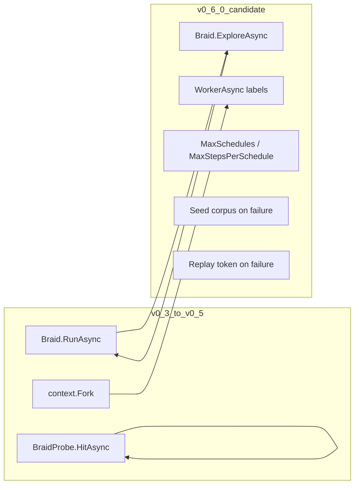

# v0.6.0 — Bounded exploration

[Index](roadmap.md) · [v0.5.0](v0.5.0-roadmap.md) · [v0.7.0](v0.7.0-roadmap.md)

**Status:** planned (design-first; code optional in same minor).

## Theme

Bounded exploration with an optional worker-oriented facade. Explicit probes only.

**Not in v0.6.0:** automatic await interception, `TaskScheduler` replacement, exhaustive model checking.

## Architecture (RFC — not final)



## Bounded exploration

| Concept | Intent |
|---------|--------|
| `WithMaxSchedules` | Cap distinct schedules per run |
| `WithMaxStepsPerSchedule` | Cap schedule length during search |
| Seed corpus | Persist failing seeds (docs convention first; API optional) |
| Failure output | Replay token via `TryGetReplayText` / schedule builder |
| Probes | Only orders existing `HitAsync`; no implicit discovery in v0.6.0 unless RFC expands |

## Possible API (not committed)

```csharp
await Braid.ExploreAsync(
    options => options
        .WithSeed(123)
        .WithMaxSchedules(1_000)
        .WithMaxStepsPerSchedule(100),
    async braid =>
    {
        await braid.WorkerAsync("reader", ReaderAsync);
        await braid.WorkerAsync("writer", WriterAsync);
    });
```

Maps to `RunAsync` + `Fork` + stable worker ids + `BraidProbe.HitAsync` inside workers.

## Compatibility

- `RunAsync` remains primary and stable
- `ExploreAsync` additive; shared scheduler core
- New types/overloads only; no `BraidContext` rename
- Failures: `BraidRunException` with replay token when exportable

## Phased deliverables

| Phase | Deliverable |
|-------|-------------|
| Design | `explore-async-rfc.md` (to add) |
| Optional code | `ExploreAsync` + options builder + tests |
| Docs | README “Explore” section; limits vs `RunAsync` |

## PRs

| PR | Scope |
|----|-------|
| `design-explore-async-rfc` | RFC only |
| `explore-async-prototype` | **Only if RFC approved** |

## Open design questions

- Schedule enumeration (DFS, random extensions, fairness)?
- `BraidOptions.Iterations` vs exploration iterations?
- `WorkerAsync` vs manual `Fork` ids?
- Probe discovery without source generators?
- First failure only vs collect N failures?
- Seed corpus file format and CI policy?
- Named workers required up front?

## Test plan (when implementing)

- Bounds: max schedules, max steps
- Determinism: same seed + bounds → same first failure
- Replay token round-trip from exploration failure
- All v0.5.x `RunAsync` tests unchanged

## Must not do

- Await interception
- IL rewriting
- Full model checking as default
- Distributed simulation
- Coyote parity claims
- Breaking `RunAsync` users
